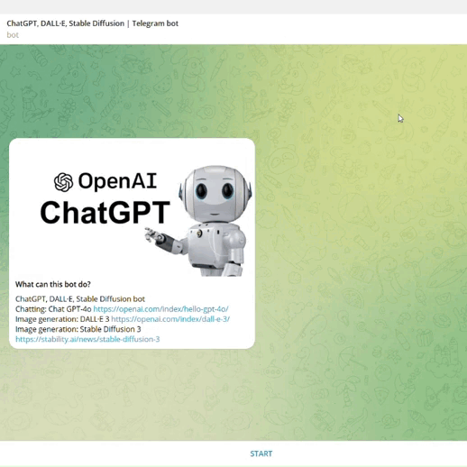

# ChatGPT, DALL·E, Stable Diffusion Telegram bot

## Table of Contents

+ [Start](#start)
+ [ChatGPT](#chatgpt)
+ [DALL·E](#dalle)
+ [Stable Diffusion](#stablediffusion)
+ [Account and buy](#accountbuy)
+ [Tests](#tests)
+ [Variables](#variables)
+ [Database](#database)
+ [How to deploy](#howtodeploy)
+ [License](#license)

## Start <a name = "start"></a>
When the user enters the start command, the bot sends him a welcome message stating that the user has free 3000 ChatGPT tokens, 3 DALL·E image generations and 3 Stable Diffusion image generations and displays 4 buttons: "💭Chatting — ChatGPT-4o", "🌄Image generation — DALL·E 3", "🌅Image generation — Stable Diffusion 3" and "👤My account | 💰Buy". If the user is already registered, the bot only displays buttons.



## ChatGPT <a name = "chatgpt"></a>
If the user wants to chat with ChatGPT, he presses the "💭Chatting — ChatGPT" button and chats.

This bot saves the context of the dialogue!


In [openaitools.py](app/services/openaitools.py) in the OpenAiTools class there are three parameters in the get_chatgpt function:

```model``` - The model which is used for generation.

```max_tokens``` - The maximum number of tokens that can be generated in the chat completion.

```temperature``` - What sampling temperature to use, between 0 and 2. Higher values like 0.8 will make the output more random, while lower values like 0.2 will make it more focused and deterministic.

## DALL·E <a name = "dalle"></a>
If the user wants to generate image with DALL·E, he presses the "🌄Image generation — DALL·E" button and generates.


Generated image:


In [openaitools.py](app/services/openaitools.py) in the OpenAiTools class there are three parameters in the get_dalle function:

```model``` - The model which is used for generation.

```n``` - The number of images to generate. Must be between 1 and 10.

```size``` - The size of the generated images. Must be one of 256x256, 512x512, or 1024x1024.

## Stable Diffusion <a name = "stablediffusion"></a>
If the user wants to generate image with Stable Diffusion, he presses the "🌅Image generation — Stable Diffusion" button and generates.


Generated image:


In [stablediffusion.py](app/services/stablediffusion.py) there is one parameter:

```model``` - The model to use for generation: sd3-medium requires 3.5 credits per generation, sd3-large requires 6.5 credits per generation, sd3-large-turbo requires 4 credits per generation.

## Account and buy <a name = "accountbuy"></a>
If the user wants to see account information or buy tokens and generations, he presses the "👤My account | 💰Buy" button. After pressing the button, the bot displays information about the rest of the user's ChatGPT tokens, DALL·E image generations and Stable Diffusion image generations. If the user wants to buy tokens and generations, he presses the "💰Buy tokens and generations" button, selects the product and currency. After that, the user needs to press the "💰Buy" button and pay in Crypto Bot if he wants to pay. If the user has paid, he should press "☑️Check" button and tokens or image generations will be added to his account. If the user hasn't paid, the bot will display the message "⌚️We have not received payment yet".

Payments are processed via webhooks.


## Tests <a name = "tests"></a>

Unit tests are located in [tests folder](tests).

Coverage 91%:


## Variables<a name = "variables"></a>

All variables: 

```OPENAI_API_KEY``` - OpenAI API key

```STABLE_DIFFUSION_API_KEY``` - Stable Diffusion API key

```TELEGRAM_BOT_TOKEN``` - Telegram Bot API key

```CRYPTOPAY_KEY``` - Crypto Bot API key

```BASE_WEBHOOK_URL``` - Server URL

```DATABASE_URL``` - Database URL

## Database <a name = "database"></a>

This project requires PostgreSQL database with two tables: users(user_id, username, chatgpt, dall_e, stable_diffusion), orders(invoice_id, user_id, product) and messages(id, user_id, role, content, messages). 

Users and information about them will be added to the "users" table, orders will be added to the "orders" table and ChatGPT context window messages will be added to the "messages" table.

```DATABASE_URL``` - database url.

## How to deploy <a name = "howtodeploy"></a>

This project can be easily deployed on the [Railway](https://railway.app/) (if all variables are passed here and a Postgres database is created, BASE_WEBHOOK_URL is a free URL from Railway).

It can be also deployed via [docker-compose.yml](docker-compose.yml) if all variables are passed into the [.env](.env) file.
```BASE_WEBHOOK_URL``` in this case can be obtained via ngrok.

## License <a name = "license"></a>

[License](https://github.com/vladislav-bordiug/ChatGPT_DALL_E_StableDiffusion_Telegram_Bot/blob/main/LICENSE) - this project is licensed under Apache-2.0 license.
